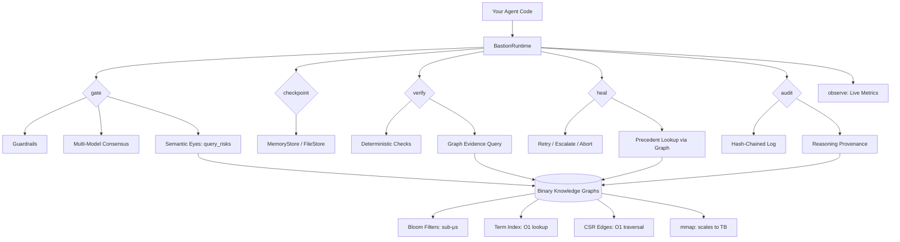

# Bastion

**Experimental safety primitives for agentic AI systems.**

A Rust + Tokio library exploring how to make AI agents safer through consensus, checkpointing, verification, and audit trails. This is a research project, not production software.

---

## What This Is

Bastion is an experimental library that provides safety primitives for AI agent systems:

- **Consensus gating** — Route actions through multiple models, require agreement before proceeding
- **Checkpointing** — Snapshot state before risky operations, rollback if things go wrong
- **Verification** — Deterministic checks for empty responses, confidence drops, and hallucination markers
- **Audit logging** — Hash-chained log entries for traceability
- **Self-healing** — Simple retry/escalate/abort decision tree
- **Pluggable guardrails** — Spending limits, dangerous pattern detection, human-in-the-loop

## Status

**Experimental / v0.1** — The APIs work, the demo runs, 15 tests pass. But this hasn't been stress-tested under real load, hasn't handled production failure modes, and the error handling is basic. Use it to learn from, prototype with, or build on top of — not to run critical systems on.

## Quick Start

```bash
cargo add bastion-core
```

```rust
use bastion_core::prelude::*;

let runtime = BastionRuntime::builder()
    .add_agent(my_agent_1)
    .add_agent(my_agent_2)
    .add_agent(my_agent_3)
    .consensus(ConsensusStrategy::Majority)
    .guardrail(Box::new(SpendingLimit { max_usd: 10_000.0 }))
    .verification(Box::new(HallucinationCheck))
    .build();

let outcome = runtime.gate("execute trade AAPL 100 shares").await?;
let cp = runtime.checkpoint("pre-trade", state).await?;

let checks = runtime.verify("trade", &result);
if !bastion_core::verify::all_valid(&checks) {
    runtime.rollback(&cp).await?;
}
```

## Demo

```bash
cargo run --example bastion_demo
```

The demo shows four scenarios: approved action, blocked dangerous command, hallucination detection with rollback, and spending limit enforcement.

## Core Primitives

| Primitive | What it does |
|-----------|-------------|
| `gate()` | Multi-model consensus before any action |
| `checkpoint()` | Snapshot state before risky operations |
| `verify()` | Deterministic hallucination and drift detection |
| `rollback()` | Restore to a known-good checkpoint |
| `audit()` | Hash-chained immutable logging |
| `observe()` | Basic metrics — cost, latency, error rate |
| `heal()` | Simple decision tree — retry, escalate, or abort |

## Guardrails

Ships with a few example guardrails. Implement the `Guardrail` trait to add your own:

| Guardrail | What it does |
|-----------|-------------|
| `SpendingLimit` | Blocks transactions above a threshold |
| `DangerousPatterns` | Catches `rm -rf`, `DROP TABLE`, `eval()` |
| `MedicalDisclaimer` | Flags medical content for human review |
| `HumanInLoop` | Requires human approval for all actions |

## Verification

Built-in deterministic checks (no LLM call needed):

| Check | What it catches |
|-------|----------------|
| `NotEmpty` | Agent returned null/empty result |
| `FileExists` | Agent claims a file exists but it doesn't |
| `ConfidenceThreshold` | Confidence dropped below threshold |
| `HallucinationCheck` | Output contains hedging language |

## Self-Healing

When something fails, the healer follows a simple decision tree:

```
Attempt 1 → Retry
Attempt 2 → Retry (simplified scope)
Attempt 3 → Escalate to human
Same error twice → Escalate (oscillation detected)
Drift detected → Rollback to checkpoint
Max retries exceeded → Abort
```

## Audit Trail

Every decision is logged with hash chaining. Each entry's hash includes the previous entry's hash — tamper with any entry and the chain breaks.

```rust
let (valid, broken_at) = runtime.audit_log().verify_chain();
assert!(valid);
```

## Semantic Eyes (Experimental)

A prototype knowledge graph integration layer. Memory-mapped binary graphs with bloom filters and typed edge traversal. Gives safety primitives domain context for risk assessment and precedent lookup. Works in demos but hasn't been validated at scale.

```rust
let eyes = SemanticEyes::load("./knowledge_graphs")?;
let risks = eyes.query_risks("transfer $50,000 to unknown vendor");
```

<<<<<<< HEAD
Backed by memory-mapped binary graph files — scales to terabytes without loading into RAM. The OS pages in only what's accessed. Bloom filters provide sub-microsecond cluster relevance checks. Inverted term indexes provide O(1) node lookup. CSR edge arrays provide O(1) edge traversal.

Run `cargo run --example semantic_demo` to see agents with real semantic understanding — builds a knowledge graph, traverses typed edges, and shows before/after.

## Architecture



```
ASCII fallback:

Your Agent Code
       │
       ▼
┌─────────────────────────────────────┐
│           BastionRuntime            │
│                                     │
│  gate() ──► Guardrails              │
│            ──► Consensus            │
│            ──► Semantic Eyes (graph) │
│                                     │
│  checkpoint() ──► Store             │
│  rollback()  ──► Restore            │
│                                     │
│  verify() ──► Deterministic checks  │
│            ──► Graph evidence query  │
│                                     │
│  heal() ──► Decision tree           │
│           ──► Precedent lookup       │
│                                     │
│  audit() ──► Hash-chained log       │
│           ──► Reasoning provenance   │
│  observe() ──► Live metrics         │
└─────────────────────────────────────┘
       │
       ▼
┌─────────────────────────────────────┐
│  Binary Knowledge Graphs (mmap)     │
│  Bloom filters │ Term index │ CSR   │
│  Scales to TB  │ < 1GB RAM  │ O(1)  │
└─────────────────────────────────────┘
```

## Example: Agent Tool Call with Full Safety Pipeline

```rust
use bastion_core::prelude::*;
use bastion_core::SemanticEyes;

// Load knowledge graph (mmap — instant, no RAM)
let eyes = SemanticEyes::load("./knowledge_graphs").unwrap();

// Build runtime with 3 safety agents
let runtime = BastionRuntime::builder()
    .add_agent(agent_sonnet)
    .add_agent(agent_gpt4o)
    .add_agent(agent_haiku)
    .consensus(ConsensusStrategy::Majority)
    .guardrail(Box::new(SpendingLimit { max_usd: 10_000.0 }))
    .verification(Box::new(HallucinationCheck))
    .build();

// 1. Query knowledge graph for risks BEFORE gating
let risks = eyes.query_risks("execute database migration on prod");
if risks.risk_level == "high" {
    println!("Graph found {} risk factors, {} contradictions",
        risks.factors.len(), risks.contradictions.len());
}

// 2. Gate through consensus + guardrails
let outcome = runtime.gate("execute database migration on prod").await?;

// 3. Checkpoint before execution
let cp = runtime.checkpoint("pre-migration", db_state).await?;

// 4. Execute the action...
let result = execute_migration().await;

// 5. Verify with deterministic checks + graph evidence
let checks = runtime.verify("migration", &result);
let evidence = eyes.find_evidence("database migration safety");

if !bastion_core::verify::all_valid(&checks) {
    // 6. Self-heal: look up what fixed this before
    let precedent = eyes.find_precedent("database migration failure");
    println!("Found {} precedent fixes", precedent.len());

    // 7. Rollback to checkpoint
    runtime.rollback(&cp).await?;
}

// 8. Audit with reasoning provenance
let context = eyes.enrich_audit("database migration");
// Audit entry now includes: risk factors, evidence, graph traversal paths
```

## Performance

- Sub-millisecond overhead per `gate()` call (with mock agents)
- JSON checkpoint serialization with file and in-memory stores
- Thread-safe metrics collection with poisoned-lock recovery
- No external dependencies beyond Tokio

=======
>>>>>>> 71f93360ca2ad48612a00bc3513119fbe14f91b6
## Tests

```bash
cargo test
```

15 tests covering consensus, guardrails, verification, checkpointing, rollback, self-healing, and audit chain integrity.

## How This Was Built

Built by a multi-agent AI swarm (Think Tank Swarm for research, Production Swarm for code generation) in a single session. Human review and polish took about 20 minutes. Total inference cost: under $1.

## License

MIT OR Apache-2.0
