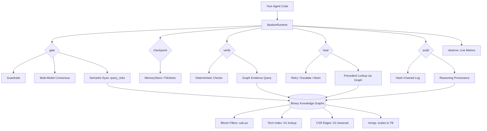

# Bastion

**The open-source Production Kernel for Agentic AI.**

Multi-model consensus, self-healing, deterministic checkpoints, immutable audit trails, and pluggable compliance guardrails — so agents can operate safely at scale.

---

## The Problem

40%+ of agentic AI projects are canceled or stuck in pilot because of error compounding, silent failures, compliance gaps, lack of auditability, and unrecoverable drift. Every company building agents hits this wall the moment they try to run long-horizon agents autonomously.

## The Solution

Bastion is a lightweight Rust + Tokio runtime layer that any agent system can run on top of. It provides the missing universal primitives:

| Primitive | What it does |
|-----------|-------------|
| `gate()` | Multi-model consensus before any action |
| `checkpoint()` | Snapshot state before risky operations |
| `verify()` | Deterministic hallucination and drift detection |
| `rollback()` | Restore to a known-good checkpoint |
| `audit()` | Immutable tamper-evident logging with cryptographic chaining |
| `observe()` | Real-time metrics — cost, latency, error rate, drift score |
| `heal()` | Self-healing decision tree — retry, escalate, or abort |

## Quick Start

```bash
cargo add bastion-core
```

```rust
use bastion_core::prelude::*;

let runtime = BastionRuntime::builder()
    .add_agent(my_safety_agent_1)
    .add_agent(my_safety_agent_2)
    .add_agent(my_safety_agent_3)
    .consensus(ConsensusStrategy::Majority)
    .guardrail(Box::new(SpendingLimit { max_usd: 10_000.0 }))
    .verification(Box::new(HallucinationCheck))
    .build();

// Gate an action through consensus
let outcome = runtime.gate("execute trade AAPL 100 shares").await?;

// Checkpoint before execution
let cp = runtime.checkpoint("pre-trade", state).await?;

// Verify the result
let checks = runtime.verify("trade", &result);
if !bastion_core::verify::all_valid(&checks) {
    runtime.rollback(&cp).await?;
}

// Metrics
let metrics = runtime.observe();
println!("Actions: {} | Blocked: {} | Drift: {}",
    metrics.total_actions, metrics.blocked, metrics.drift_detections);
```

## Demo

```bash
cargo run --example bastion_demo
```

```
  ╔══════════════════════════════════════════════════╗
  ║  BASTION — Production Kernel for Agentic AI      ║
  ╚══════════════════════════════════════════════════╝

  ── Scenario 1: Deploy API update ──
     Gate: APPROVED (100% agreement, 3/3 agents)
     Checkpoint: dc37e785
     Verify: 3 checks, all passed: true

  ── Scenario 2: Dangerous database command ──
     Gate: BLOCKED — dangerous pattern detected: drop table

  ── Scenario 3: Agent hallucinates ──
     Gate: APPROVED (100%)
     Verify: issues detected: true
     DRIFT: hallucination_check — possible hallucination marker: 'hypothetically'
     DRIFT: confidence_threshold — confidence 0.45 below threshold 0.70
     Heal: Rollback
     Rollback: restored to 'pre-analysis' checkpoint

  ── Scenario 4: Overspend attempt ──
     Gate: BLOCKED — $50000.00 exceeds limit $10000.00

  ── Audit & Metrics ──
     Audit entries: 10
     Chain integrity: VERIFIED
     Total actions: 4 | Approved: 2 | Blocked: 2
     Drift detections: 2 | Rollbacks: 1
     Avg latency: 0.0ms
```

## Domain Guardrails

Bastion ships with pluggable guardrails for different industries:

| Guardrail | Domain | What it does |
|-----------|--------|-------------|
| `SpendingLimit` | Finance | Blocks transactions exceeding a USD threshold |
| `DangerousPatterns` | Coding | Catches `rm -rf`, `DROP TABLE`, `eval()`, etc. |
| `MedicalDisclaimer` | Medical | Flags prescriptions and diagnoses for human review |
| `HumanInLoop` | Defense | Requires explicit human approval for all actions |

Implement the `Guardrail` trait to add your own:

```rust
impl Guardrail for MyCustomRule {
    fn name(&self) -> &str { "my_rule" }
    fn domain(&self) -> &str { "my_domain" }
    fn evaluate(&self, action: &str, context: &Value) -> GuardrailResult {
        // Your logic here
    }
}
```

## Verification (Hallucination & Drift Detection)

Built-in deterministic checks that run without an LLM call:

| Check | What it catches |
|-------|----------------|
| `NotEmpty` | Agent returned null/empty result |
| `FileExists` | Agent claims a file exists but it doesn't |
| `ConfidenceThreshold` | Confidence score dropped below threshold (drift) |
| `HallucinationCheck` | Output contains hedging language ("I believe", "hypothetically") |

## Self-Healing

When something fails, Bastion's healer decides what to do:

```
Attempt 1 → Retry
Attempt 2 → Retry (with simplified scope)
Attempt 3 → Escalate to human
Same error twice → Escalate (oscillation detected)
Drift detected → Rollback to checkpoint
Max retries exceeded → Abort
```

## Audit Trail

Every decision is logged with cryptographic hash chaining. Each entry's hash includes the previous entry's hash — tamper with any entry and the chain breaks.

```rust
let (valid, broken_at) = runtime.audit_log().verify_chain();
assert!(valid); // Chain integrity verified
```

Export the full audit trail as JSON for compliance review.

## Semantic Eyes — Knowledge Graph Integration

Bastion includes `semantic_eyes.rs` — a memory-mapped binary knowledge graph layer that gives every safety primitive real understanding of your domain libraries and past executions. Actions are no longer evaluated in isolation; `gate_with_context()` can ask "has this action type caused failures before?", self-healing can look up precedent fixes, and compliance checks traverse `Contradicts` / `TradeoffOf` edges through a typed knowledge graph. The existing deterministic core stays untouched.

```rust
use bastion_core::SemanticEyes;

let eyes = SemanticEyes::load("./knowledge_graphs")?;

// Query risks before approving an action
let risks = eyes.query_risks("transfer $50,000 to unknown vendor");
// risks.factors, risks.mitigations, risks.contradictions

// Find evidence supporting a compliance decision
let evidence = eyes.find_evidence("OFAC sanctions screening");

// Look up precedent for self-healing
let precedent = eyes.find_precedent("transaction velocity limit exceeded");

// Attach reasoning provenance to audit entries
let context = eyes.enrich_audit("execute high-value trade");
```

Backed by memory-mapped binary graph files — scales to terabytes without loading into RAM. The OS pages in only what's accessed. Bloom filters provide sub-microsecond cluster relevance checks. Inverted term indexes provide O(1) node lookup. CSR edge arrays provide O(1) edge traversal.

## Architecture



```
ASCII fallback:

Your Agent Code
       │
       ▼
┌─────────────────────────────────────┐
│           BastionRuntime            │
│                                     │
│  gate() ──► Guardrails              │
│            ──► Consensus            │
│            ──► Semantic Eyes (graph) │
│                                     │
│  checkpoint() ──► Store             │
│  rollback()  ──► Restore            │
│                                     │
│  verify() ──► Deterministic checks  │
│            ──► Graph evidence query  │
│                                     │
│  heal() ──► Decision tree           │
│           ──► Precedent lookup       │
│                                     │
│  audit() ──► Hash-chained log       │
│           ──► Reasoning provenance   │
│  observe() ──► Live metrics         │
└─────────────────────────────────────┘
       │
       ▼
┌─────────────────────────────────────┐
│  Binary Knowledge Graphs (mmap)     │
│  Bloom filters │ Term index │ CSR   │
│  Scales to TB  │ < 1GB RAM  │ O(1)  │
└─────────────────────────────────────┘
```

## Example: Agent Tool Call with Full Safety Pipeline

```rust
use bastion_core::prelude::*;
use bastion_core::SemanticEyes;

// Load knowledge graph (mmap — instant, no RAM)
let eyes = SemanticEyes::load("./knowledge_graphs").unwrap();

// Build runtime with 3 safety agents
let runtime = BastionRuntime::builder()
    .add_agent(agent_sonnet)
    .add_agent(agent_gpt4o)
    .add_agent(agent_haiku)
    .consensus(ConsensusStrategy::Majority)
    .guardrail(Box::new(SpendingLimit { max_usd: 10_000.0 }))
    .verification(Box::new(HallucinationCheck))
    .build();

// 1. Query knowledge graph for risks BEFORE gating
let risks = eyes.query_risks("execute database migration on prod");
if risks.risk_level == "high" {
    println!("Graph found {} risk factors, {} contradictions",
        risks.factors.len(), risks.contradictions.len());
}

// 2. Gate through consensus + guardrails
let outcome = runtime.gate("execute database migration on prod").await?;

// 3. Checkpoint before execution
let cp = runtime.checkpoint("pre-migration", db_state).await?;

// 4. Execute the action...
let result = execute_migration().await;

// 5. Verify with deterministic checks + graph evidence
let checks = runtime.verify("migration", &result);
let evidence = eyes.find_evidence("database migration safety");

if !bastion_core::verify::all_valid(&checks) {
    // 6. Self-heal: look up what fixed this before
    let precedent = eyes.find_precedent("database migration failure");
    println!("Found {} precedent fixes", precedent.len());

    // 7. Rollback to checkpoint
    runtime.rollback(&cp).await?;
}

// 8. Audit with reasoning provenance
let context = eyes.enrich_audit("database migration");
// Audit entry now includes: risk factors, evidence, graph traversal paths
```

## Performance

- Sub-millisecond overhead per `gate()` call (with mock agents)
- Zero-copy checkpoint serialization
- Lock-free metrics collection
- No external dependencies beyond Tokio

## Tests

```bash
cargo test
```

15 integration tests covering consensus, guardrails, verification, checkpointing, rollback, self-healing, audit chain integrity, and metrics tracking.

## License

MIT OR Apache-2.0
